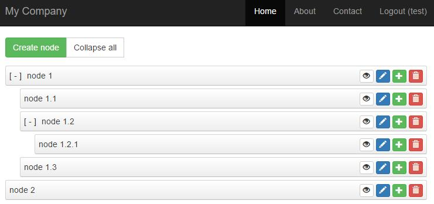

# yii2-tree-manager v0.0.17 (ADD# node move action)

[](https://packagist.org/packages/yongtiger/yii2-tree-manager)
[](https://packagist.org/packages/yongtiger/yii2-tree-manager) 
[](https://packagist.org/packages/yongtiger/yii2-tree-manager)
[](https://packagist.org/packages/yongtiger/yii2-tree-manager)




## FEATURES

* Sample of extensions directory structure. `src`, `docs`, etc.
* `README.md`
* `composer.json`
* `development-roadmap.md`


## DEPENDENCES


## INSTALLATION   

The preferred way to install this extension is through [composer](http://getcomposer.org/download/).

Either run

```
php composer.phar require --prefer-dist yongtiger/yii2-tree-manager "*"
```

or add

```json
"yongtiger/yii2-tree-manager": "*"
```

to the require section of your composer.json.


## CONFIGURATION


## USAGES

```php
echo \yongtiger\tree\widgets\TreeView::widget([
    'nodes' => $items,

    ///all the followings are optional
    'options' => [
        'tag' => 'div',         ///set to false to disable the tag
        'class' => 'myclass',
        // more ...
    ],
    'nodesOptions' => [
        'tag' => 'ol',          ///set to false to disable the tag
        'class' => 'myclass',
        // more ...
    ],
    'nodeOptions' => [
        'tag' => 'li',          ///set to false to disable the tag
        'class' => 'myclass',
        // more ...
    ],

    'clientOptions' => [
        'selector' => 'ol.sortable',
        'startCollapsed' => true,
        // more ...
    ],
    'clientEventOptions' => [
        'change' => "function(){ console.log('Relocated item'); }",
        // more ...
    ],

    'nodeActionsOptions' => [
        'tag' => 'span',        ///set to false to disable the tag
        'class' => 'myclass',
        // more ...
    ],
    'nodeActionOptions' => [
        'tag' => 'button',      ///set to false to disable the tag
        // more ...
    ],
    'nodeActions' => [
        'view' => [
            'actionText' => '<span class="glyphicon glyphicon-eye-open"></span>',
            'actionOptions' => [
                'class' => 'btn btn-xs btn-default',
            ],
        ],
        'update' => [
            'actionText' => '<span class="glyphicon glyphicon-pencil"></span>',
            'actionOptions' => [
                'class' => 'btn btn-xs btn-primary',
            ],
        ],
        'create' => [
            'actionText' => '<span class="glyphicon glyphicon-plus"></span>',
            'actionOptions' => [
                'class' => 'btn btn-xs btn-success',
            ],
        ],
        'delete' => [
            'actionText' => '<span class="glyphicon glyphicon-trash"></span>',
            'actionOptions' => [
                'class' => 'btn btn-xs btn-primary',
                'data-confirm' => 'Are you sure you want to delete this item?', ///???i18n
                'data-method' => 'post',
                ///for ajax
                'href' => 'javascript:void(0)',         ///Note: It will override the 'href' of `nodeActionOptions`
                'data-action-url' => '{action-url}',    ///Note: It will be replaced with the URL created using [[createUrl()]]
            ],
        ],
        // more ...
    ],

    'urlCreator' => function ($action, $id, $treeView) {
        // return 'string';
    },
    'controller' => 'category/default',
    
    'nodeNameTemplate' => '<span class="disclose"><span></span></span>{name}',
    'encodeNodeNames' => true,
]);
```


## NOTES


## DOCUMENTS


## REFERENCES

### Example of TreeView nodes data ($items):

```php
Array(
    [0] => Array(
        [id] => 1
        [name] => node 1

        ///optional, action urls
        [view-url] => Array(
            [0] => category/default/view
            [id] => 1
        )
        [update-url] => Array(
            [0] => category/default/update
            [id] => 1
        )
        [create-url] => Array(
            [0] => category/default/create
            [id] => 1
        )
        [delete-url] => Array(
            [0] => category/default/delete
            [id] => 1
        )

        [nodes] => Array(
            [0] => Array(
                [id] => 2
                [name] => node 1.1
                // optional, action urls ...
            )
            [1] => Array(
                [id] => 3
                [name] => node 1.2
                // optional, action urls ...
            )
            // more nodes ...
        )
    )
    [1] => Array(
        // ...
    )
)
```


### Example of `nestedSortable` html code:

```
<ol class="sortable">
    <li id="list_368">
        <div>   <span class="disclose"><span></span></span>Driving Directions</div>
    </li>
    <li id="list_369">
        <div>   <span class="disclose"><span></span></span>Food Menu</div>
        <ol class="sortable">
            <li id="list_373">
                <div>   <span class="disclose"><span></span></span>Meals</div>
            </li>
            <li id="list_374">
                <div>   <span class="disclose"><span></span></span>Pizza & Pasta</div>
            </li>
        </ol>
    </li>
</ol>
```


### `jquery-ui version 1.11.4` options:

```
// appendTo: "parent",
// axis: false,
// connectWith: false,
// containment: false,
// cursor: "auto",
// cursorAt: false,
// dropOnEmpty: true,
forcePlaceholderSize: true,                 ///defaults to false 
// forceHelperSize: false,
// grid: false,
handle: 'div',                              ///defaults to false
helper: 'clone',                            ///defaults to "original"
items: 'li',                                ///defaults to "> *"
opacity: .6,                                ///defaults to false 
placeholder: 'placeholder',                 ///defaults to false 
revert: 250,                                ///defaults to false 
// scroll: true,
// scrollSensitivity: 20,
// scrollSpeed: 20,
// scope: "default",
tolerance: 'pointer',                       ///defaults to "intersect" 
toleranceElement: '> div',                  ///defaults to null 
// zIndex: 1000,
```


### `jquery.mjs.nestedSortable.js v 2.0b1` options:

```
// disableParentChange: false,
// doNotClear: false,
// expandOnHover: 700,
// isAllowed: function() { return true; },
isTree: true,                               ///defaults to false
// listType: "ol",
// maxLevels: 0,
// protectRoot: false,
// rootID: null,
// rtl: false,
// startCollapsed: false,
// tabSize: 20,
// branchClass: "mjs-nestedSortable-branch",
// collapsedClass: "mjs-nestedSortable-collapsed",
// disableNestingClass: "mjs-nestedSortable-no-nesting",
// errorClass: "mjs-nestedSortable-error",
// expandedClass: "mjs-nestedSortable-expanded",
// hoveringClass: "mjs-nestedSortable-hovering",
// leafClass: "mjs-nestedSortable-leaf",
// disabledClass: "mjs-nestedSortable-disabled",
```


## SEE ALSO

- https://github.com/ilikenwf/nestedSortable
- http://jsfiddle.net/vq9dD/2/


## TBD


## [Development roadmap](docs/development-roadmap.md)


## LICENSE 
**yii2-tree-manager** is released under the MIT license, see [LICENSE](https://opensource.org/licenses/MIT) file for details.
